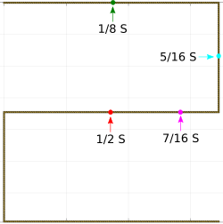
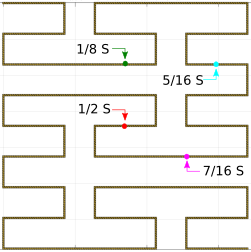
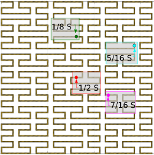

# Introduction
This is an application to obtain resonance frequencies and VSWR of Peano antennas, they are FASS (space-filling, self-avoiding, and self-similar) type 
with a trace length of S. 
 

* Antenna characteristics:
  * microstrip dipole antenna
  * iterations  1 ,2 or 3
  * lateral size L from 0.01m  to 0.1m
  * made of metal 
  * air substrate 
  * width of 0.25mm, 0.5mm  and 1.0 mm 
  * feeding point at 1/8S , 7/16S ,5/16S y 1/2S   

The general equation for resonance and VSWR is:
  * 

where "a" is given in [m MHz], b[m], F[MHz] and L[m].

The polynomial for bandwidth is:
  * 

BW is given in percentage of VSWR frequency 

Feedings points:
* Peano iteration 1  
* Peano iteration 2 
* Peano iteration 3 

 

# Download  &  use 

The application consists of a single file written in Python 3.7 which must be executed from the command line. 

* Command line parameters.

   * p		properties (vswr,resonance).   
   * g		generate the mesh.   
   * vswr	calculates the center frequency with  VSWR < 2
   * r		calculates the resonance frequency 
   * g		generates antenna geometry in a file .m  for processing in MATLAB  
   * i		antenna iteration (1,2,3)   
   * F		frequency [MHz] (300MHz-3000MHz)   
   * d		antenna width [mm] (0.25,0.5,1.0)   
   * L		lateral size [m] (0.001m-0.1m)   
   * feed	feeding point [0.125,0.1875,0.4375,0.5]   
   * file	filename 
 

# Running examples

Calculate the resonant frequencies of a Peano antenna with a lateral size L=0.088m,  width d=0.5mm, iteration i=3 with feed point at 1/8S (0.125S) and frequency F=1500 MHz

python Peano_antennas.py -p -r -i 3  -L 0.088  -d 0.25 -feed 0.5 -F 1500

Calculate the center frequencies with VSWR <2 of a Peano antenna with a lateral size L=0.033m, width d=0.25mm, an iteration i=3 with feed point at 7/16S (0.4375)

python Peano_antennas.py -p -vswr -i 3 -L 0.033 -d 0.25 -feed 0.4375

Calculate the properties of the iteration antenna i=1 with the feed point at 1/8S (0.125), d=1.0mmn  and center frequency with VSWR<2 at 1650 MHz.

python Peano_antennas.py  -vswr -i 1  -feed 0.125 -F 1650.0  -d 1.0

Generate the geometry of a Peano antenna with i=2, d=1.0mm, the feed point at 0.5S, L-system step of n=4 and filename peano2.m

python Peano_antennas.py -g  -i=2 -feed=0.5 -d=1.0 -file peano2 -n=4

 
